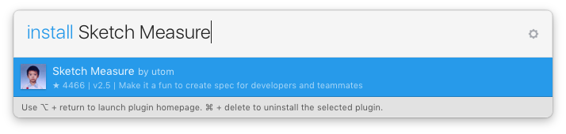

# A new feature for Sketch Measure: Export Layer's influence Rect to Spec.

Layer's influence rect includes the area of shadows and outside borders, it's exactly the same size with the exported image.

                                       Regular rect                                                           Influence rect
​              

Sometime, shadows will not implement by engineers, it should be a part of image. Designer need to show the influence rect to engineers, not the regular rect. This is the feature using for.

Just select the option in Export UI

# Sketch Measure

Make it fun to create specs for developers and teammates. **Sketch 41.* support**.

- [How to](http://utom.design/measure/how-to.html)
- [中文说明](http://sketch.im/plugins/1)

## Installing Plugins

### Install from download
1. [Download the ZIP file](https://github.com/utom/sketch-measure/archive/master.zip) and unzip
2. Open `Sketch Measure.sketchplugin`

### Install with Sketch Plugin Manager
1. With [Sketch Plugin Manager](https://mludowise.github.io/Sketch-Plugin-Manager/), just search `Sketch Measure`
2. Will see the `Sketch Measure` plugin listed at the top, Click the `Install` inside it
#[!Install with Sketch Plugin Manager](https://github.com/mludowise/Sketch-Plugin-Manager/raw/master/img/catalog-view.png)

### Install with Sketchpacks
1. With [Sketchpacks](https://sketchpacks.com), search for `Sketch Measure`
2. Click `Install`
3. Get automatic updates for `Sketch Measure`

**Already have Sketchpacks?**

### Install with Sketch Runner
With Sketch Runner, just go to the `install` command and search for `Sketch Measure`. Runner allows you to manage plugins and do much more to speed up your workflow in Sketch. [Download Runner here](http://www.sketchrunner.com).

## New UI
Friendly user interface offers you a more intuitive way of making marks.

### How to
* Hold down the `Option` key on keyboard and click icons on the toolbar to show panels.

## Spec Export
Automatically generate a html page with one click, and inspect all the design details including CSS Styles on it offline.

**If you want to create one artboard by one HTML file, please uncheck "Advanced mode".**

Demo: http://utom.design/news/

## Custom Shortcuts
To create your own custom shortcuts, go to Keyboard in your System Preferences and click the Shortcuts tab. Select App Shortcuts and click ‘+’ to create a new shortcut. Choose Sketch from the Application list, then enter the exact name of the menu item you want to create the shortcut for. Finally choose your own shortcut combination and you’re all set.

## Contributors
* Author [@utom](http://utom.design)
* [@cute](http://liguangming.com) ([SketchI18N](https://github.com/cute/SketchI18N))
* [@forestlin1212](https://github.com/forestlin1212)
* [@ashung](https://github.com/Ashung) ([Automate-Sketch](https://github.com/Ashung/Automate-Sketch))
* [@mkl87](https://github.com/mkl87), [@Skykai521](https://github.com/Skykai521), [@whyfind](https://github.com/whyfind) and [@Nora](https://www.behance.net/liyinuo)
* @Kai and [@Zih-Hong](http://zihhonglin.com)
* And [Other](https://github.com/utom/sketch-measure/contributors)

## Contact

* Follow [@utom](http://twitter.com/utom) on Twitter
* Email <utombox@gmail.com>
